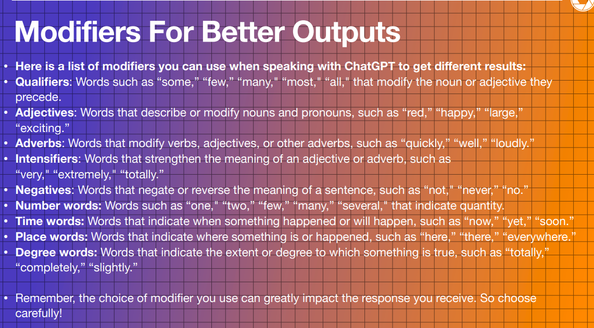

# 🌠 ChatGPT: Fundamentals 🌠

- **What is it..** An AI language model trained on a massive amount of text data that generates natural language responses in a conversational style. (Aka a magic genis)

- **Future of it...** this tool and others like it will be seamlessly integrated into our computers and smartphones, eventually becoming a full-time personal assistant custom tailored to you.

- **Main benefits..** Saving time, saving time, saving time. But also, extending into fields.

### Main Types of Outputs:

- **Synthesizing info** - Summarize large amounts of content in a concise way.
- **Content Creation and Copy** - Generate brand new content for a specific topic and purpose.
- **Learning and Research** - Get questions answered for extremely specific needs.\* **Coding** - Generate code, info on programming concepts and APIs, and debuggin.

## ChatGPT 🆚 Google

ChatGPT and Google search are both AI-powered tools, but they differ in several ways:

1. **Purpose 🔪**: Google search is a search engine that helps you find information on the web, while ChatGPT is an interactive tool that not only finds you the information you're searching for but can **"intelligently"**, process that information and personalize for your needs/prompts.

2. **Input ⌨️**: Google search requires a user to type in a query, whereas ChatGPT interacts with users in a conversational or iterative manner, you must work with it to get the desired output such as asking follow up questions. (Even if yoou don't know what question to ask.

3. **Output 📤**: Google search provides a list of links to web pages that contain the information you're looking for, while ChatGPT generates responses in natural language that are tailored to your specific needs.

4. **Scope 🎯**: Google search is limited to the information available on the web, while ChatGPT can generate responses based on a wide range of data sources, including books, articles, and other text-based content.

### Plugins 🔌

In the plus version, you can install plugins to extend the functionality of ChatGPT.

Also It have personalize gpts, they are trained on specific topics and can generate more accurate and relevant responses for those topics.

## Effectively Creating Prompts

### Levels of Explanation and Broad vs. Narrow Promps 📚

- Explain "the sun" to me as a 1st grader vs high school vs astrophysicist.
- Top books I should read this year vs. top 10 books I should read as up and coming musician.

### ChatGPT Formul: GITHUB PromptBook

[Awesome Prompts ✍️ ] (https://github.com/f/awesome-chatgpt-prompts/blob/main/prompts.csv)

1. Consider the context of you prompt aka how do you want GPT to engage with you:

- "Your going to act as"
- "Ignore all previous instructions before this one", "Tone friendly and casual", "Tone serious and formal", "Explain this to a 5 year old"
  > "You're an exercise and health expert. You have helped al ages of people lose weight, get in shape and improve their health for 20 years. You're ask is now to give the best advice when it comes to improving someone's health. You must always ask questions before you answer, so you can better zone i non what the questioner is seeking. Is that understood?"

2. Give your model a task to complete: your task is to create XYZ in XYZ words... aka compression vs decompression.
3. Be specific: do not include XYZ, remove this symbol/number, etc.
4. Ask questions: Further elaborate on specific outputs from the previous answer. (breakdown answer #5 of this list)
5. Consider the output: if you don't like your results, refine the prompt to be as specific as possible.

### More Unique Prompts for Answers:

- "What would I not think of - on this topic"
- "What are some uncommon or less well known answers to this same questions."

> [!NOTE]
> Look at the next url in order to understand how works a token in apis.

[Open AI platform](https://platform.openai.com/)

### Copy Right Shield

Open AI will pay all the costs of any legal action against you for using their model, as long as you follow the guidelines.
